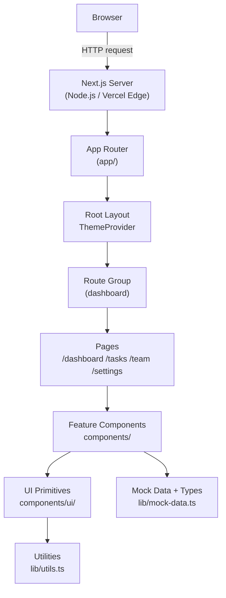
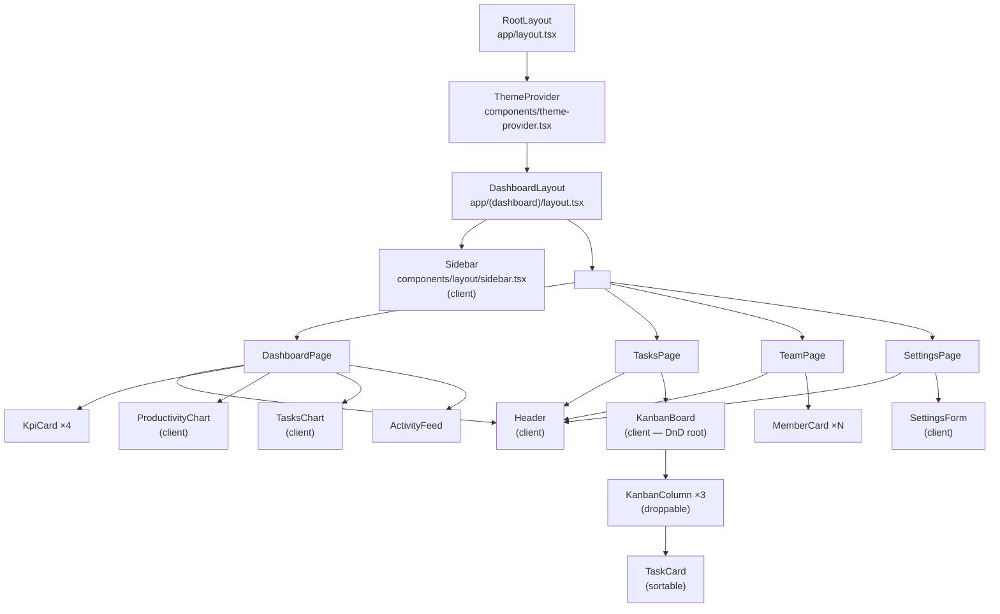
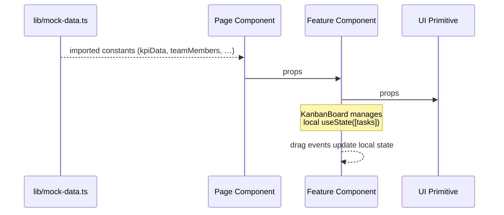
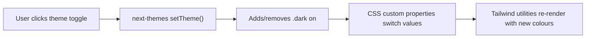
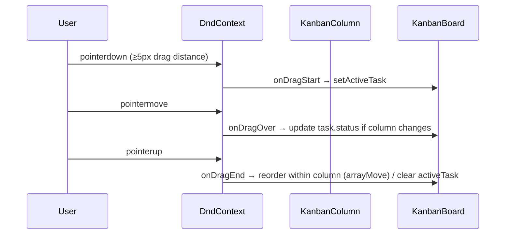

# Architecture

This document describes the high-level architecture of TeamPulse, the relationships between its components, and the key design decisions made during development.

---

## High-Level Overview

TeamPulse is a **client-rendered, static-data SaaS dashboard** built on the Next.js App Router. There is no backend server, no database, and no API — all application data is defined as TypeScript constants in `lib/mock-data.ts`.



---

## Application Layers

| Layer | Location | Responsibility |
|---|---|---|
| **Routing** | `app/` | File-system routing via Next.js App Router |
| **Layouts** | `app/layout.tsx`, `app/(dashboard)/layout.tsx` | Wrapping components (ThemeProvider, Sidebar) |
| **Pages** | `app/(dashboard)/*/page.tsx` | Page-level composition, data selection |
| **Feature Components** | `components/{dashboard,tasks,team,settings}/` | Business-logic display components |
| **UI Primitives** | `components/ui/` | Stateless, reusable building blocks |
| **Data Layer** | `lib/mock-data.ts` | Typed static data — single source of truth |
| **Utilities** | `lib/utils.ts` | Pure helper functions (`cn`) |
| **Styling** | `app/globals.css` | CSS custom properties (design tokens) |

---

## Routing Structure

Next.js App Router file-system routing is used. The `(dashboard)` directory is a **route group** (parentheses prevent the segment from appearing in the URL).

```
/          → app/page.tsx              → redirect to /dashboard
/dashboard → app/(dashboard)/dashboard/page.tsx
/tasks     → app/(dashboard)/tasks/page.tsx
/team      → app/(dashboard)/team/page.tsx
/settings  → app/(dashboard)/settings/page.tsx
```

Both layouts are server components. The sidebar and header are rendered server-side; interactive elements inside them (collapse toggle, theme switch) are client components marked with `"use client"`.

---

## Component Hierarchy



---

## Data Flow

Because there is no backend, all data flows are **unidirectional and local to the client**:



The sole piece of interactive local state that spans UI interactions is the task list inside `KanbanBoard` (managed with `useState`). All other components are purely presentational.

Theme state (`"light"` | `"dark"`) is managed by `next-themes` and persisted in `localStorage`.

---

## State Management

| State | Owner | Persistence |
|---|---|---|
| Task list (Kanban) | `KanbanBoard` (`useState`) | In-memory (resets on page refresh) |
| Active drag task | `KanbanBoard` (`useState`) | In-memory |
| Sidebar collapsed | `Sidebar` (`useState`) | In-memory |
| Dark / light theme | `next-themes` | `localStorage` |
| Settings form fields | `SettingsForm` (`useState`) | In-memory |
| Notification toggles | `SettingsForm` (`useState`) | In-memory |

> **Technical debt:** No global state management (Zustand, Redux, Context) is used. This is fine for a static demo but would need to be addressed before connecting a real backend — task mutations, user profile saves, and notification preferences would all require server synchronisation.

---

## Theming System

Theming is implemented with **CSS custom properties** declared in `app/globals.css`. Two sets of variables are defined: one under `:root` (light mode) and one under `.dark` (dark mode). Tailwind CSS v4's `@theme inline` block maps the CSS variables to Tailwind colour utilities (e.g. `bg-background`, `text-foreground`).

`next-themes` toggles the `.dark` class on the `<html>` element when the user switches modes.



---

## Drag-and-Drop Architecture

The Kanban board uses the **@dnd-kit** library:

- `DndContext` (in `KanbanBoard`) is the root DnD provider.
- Each `KanbanColumn` registers itself as a `useDroppable` zone with the column's status string as its `id`.
- Each task card is wrapped in a `SortableTaskCard` which uses `useSortable` from `@dnd-kit/sortable`.
- A `DragOverlay` renders the dragged card floating above the board during drag.



---

## Key Design Decisions

| Decision | Rationale |
|---|---|
| **Next.js App Router** | Modern file-based routing; server components by default reduce client JS bundle |
| **Route group `(dashboard)`** | Applies a shared sidebar layout to all inner routes without adding a URL segment |
| **Static mock data** | Allows the project to run without any backend or environment setup |
| **Tailwind CSS v4** | CSS-native design tokens via `@theme inline` — no `tailwind.config.js` required |
| **Radix UI primitives** | Accessibility built-in; used as the base for all interactive UI primitives |
| **CSS custom properties for theming** | Single source of truth for colours — both Tailwind utilities and raw `hsl(var(--…))` values work consistently |
| **`cn()` utility** | `clsx` + `tailwind-merge` combination prevents class conflicts when composing conditional Tailwind classes |
| **@dnd-kit over react-beautiful-dnd** | Actively maintained, TypeScript-first, pointer-sensor based (works on touch) |

---

## Missing / Not Implemented

- **No API routes** — `app/api/` does not exist.
- **No authentication** — any user can access all pages.
- **No database** — all data is ephemeral mock data.
- **No tests** — no unit, integration, or end-to-end test suite.
- **No GitHub Actions** — no CI/CD workflows are configured.
- **No environment variables** — the app requires none.
- **No error boundaries** — unhandled render errors would crash the whole page.
- **No loading states / skeletons** — data is synchronous (mock), so none are needed currently.

---

## Possible Refactorings

1. **Extract sprint overview data to `lib/mock-data.ts`** — the sprint stats in `DashboardPage` are inlined as a literal array and should live in the data layer alongside the other datasets.
2. **Introduce a `TaskContext`** — if task mutations need to be accessible from multiple pages (e.g. completing a task from the dashboard), lifting Kanban state into a React context would be cleaner than prop drilling.
3. **Centralise notification / settings state** — `SettingsForm` manages its own state; a settings context (or server-persisted state) would be needed for real persistence.
4. **Sidebar collapse state to `localStorage`** — currently resets on every page refresh; persisting it mirrors how most production dashboards behave.
5. **Badge `"info"` variant in `TaskCard`** — `task-card.tsx` uses `variant="info"` for a `low` priority badge, but `low` priority is styled with `"info"`. This is intentional but the mapping (`low → info`) is only implied; an explicit comment or dedicated `"low"` variant would make the intent clearer.
