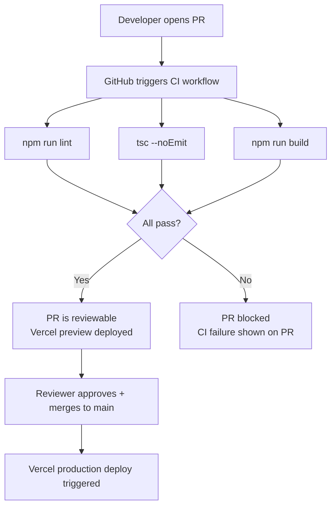

# GitHub Integration

> **⚠️ Current state:** This repository has **no GitHub Actions workflows** and no CI/CD automation configured. The `.github/` directory does not exist.

This document records the current state and describes what should be added.

---

## Current State

| Area | Status |
|---|---|
| GitHub Actions workflows | ❌ None |
| CI (lint, build, type-check) | ❌ Not automated |
| CD (deploy to Vercel / other) | ❌ Not automated |
| Pull Request checks | ❌ None |
| Branch protection rules | ❌ Unknown (not visible in repo config) |
| Dependabot / automated dependency updates | ❌ Not configured |
| Issue / PR templates | ❌ Not present |
| Changelog generation | ❌ Not automated |
| Required secrets | N/A — no workflows exist |

---

## Recommended GitHub Actions Setup

### 1. CI Workflow (Lint + Type-check + Build)

Create `.github/workflows/ci.yml`:

```yaml
name: CI

on:
  push:
    branches: [main]
  pull_request:
    branches: [main]

jobs:
  ci:
    runs-on: ubuntu-latest
    steps:
      - uses: actions/checkout@v4

      - uses: actions/setup-node@v4
        with:
          node-version: 20
          cache: npm

      - run: npm ci

      - name: Lint
        run: npm run lint

      - name: Type-check
        run: npx tsc --noEmit

      - name: Build
        run: npm run build
```

**Required secrets:** None (no external services needed for a static build).

### 2. Deploy to Vercel

The easiest deployment path is to connect the GitHub repository directly to Vercel via the Vercel dashboard — no workflow file is required. Vercel automatically deploys on every push to `main` and creates preview deployments for PRs.

If a custom workflow is preferred, add `.github/workflows/deploy.yml`:

```yaml
name: Deploy

on:
  push:
    branches: [main]

jobs:
  deploy:
    runs-on: ubuntu-latest
    steps:
      - uses: actions/checkout@v4
      - uses: amondnet/vercel-action@v25
        with:
          vercel-token: ${{ secrets.VERCEL_TOKEN }}
          vercel-org-id: ${{ secrets.VERCEL_ORG_ID }}
          vercel-project-id: ${{ secrets.VERCEL_PROJECT_ID }}
          vercel-args: '--prod'
```

**Required secrets:**
| Secret | Description |
|---|---|
| `VERCEL_TOKEN` | Personal access token from vercel.com/account/tokens |
| `VERCEL_ORG_ID` | Found in Vercel project settings |
| `VERCEL_PROJECT_ID` | Found in Vercel project settings |

### 3. Dependabot

Create `.github/dependabot.yml`:

```yaml
version: 2
updates:
  - package-ecosystem: npm
    directory: /
    schedule:
      interval: weekly
    open-pull-requests-limit: 10
```

### 4. PR Template

Create `.github/pull_request_template.md`:

```markdown
## Summary
<!-- Describe what this PR does -->

## Changes
- 

## Testing
<!-- How was this tested? -->

## Screenshots
<!-- If UI changes, add before/after screenshots -->
```

---

## Pull Request Automation Flow (When Configured)



---

## Changelog Generation

No automated changelog exists. Options to add one:

- **[conventional-changelog](https://github.com/conventional-changelog/conventional-changelog):** Requires commits to follow the Conventional Commits format (`feat:`, `fix:`, `chore:`, etc.).
- **[release-please](https://github.com/googleapis/release-please):** GitHub Action that automates release PRs and CHANGELOG.md generation based on commit history.
- **[changesets](https://github.com/changesets/changesets):** Manual changelog entry workflow, common in monorepo setups.

For a project of this size, `release-please` is the lowest-friction option.

---

## Missing Documentation

- No `CONTRIBUTING.md`
- No `CODE_OF_CONDUCT.md`
- No `SECURITY.md`
- No issue templates (`.github/ISSUE_TEMPLATE/`)
- No branch protection rules documented
